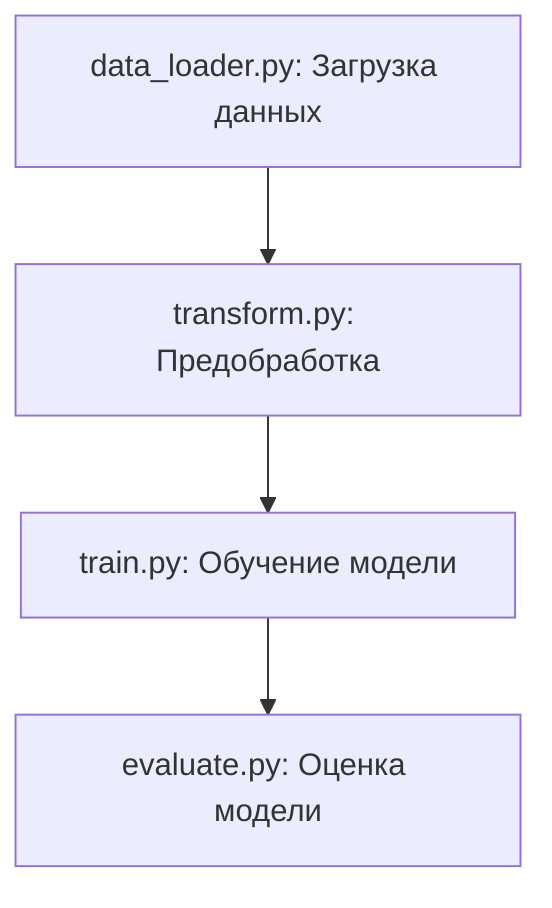
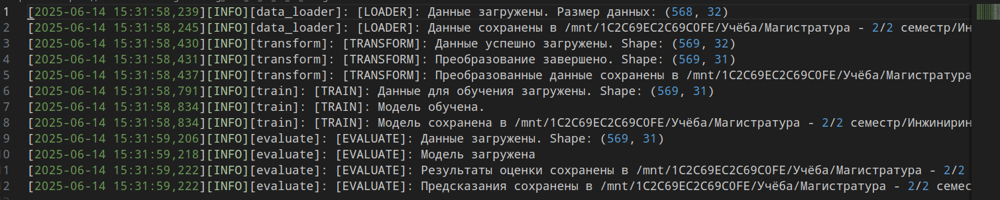
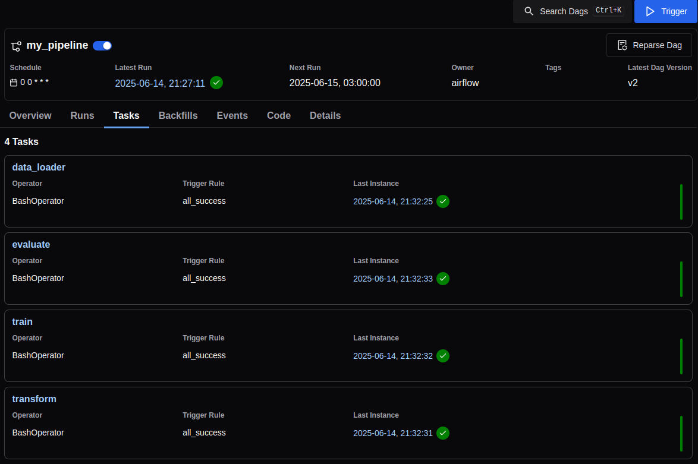

# Автоматизация и оркестрация пайплайна машинного обучения с использованием Apache Airflow и облачного хранилища.

Задача — спроектировать и реализовать автоматизированный ETL-процесс: от получения медицинских данных до выгрузки результатов модели в облачное хранилище с помощью Apache Airflow и Python.

### Структура файлов и папок репозитория:

- **dags/**  — DAG-файл для Airflow.

- **etl/**  
   Модульные Python-скрипты для шагов пайплайна (загрузка, предобработка, обучение, метрики):
   - `data_loader.py`: Загружает данные из указанного источника и сохраняет в локальном хранилище.
   - `transform.py`: Очистка о обработка данных, сохраняет очищенный датасет в локальном хранилище.
   - `train.py`: Обучение модели и сохранение в pkl-формате.
   - `evaluate.py`: Оценка качества модели и сохранение результатов.

- **results/** — финальные метрики и сохранённые артефакты модели.
   - raw_data.csv - файл с данными, запрошенный из DATA_URL
   - clear_data.csv - обработанный файл, готовый для обучения модели
   - model.pkl - сохранённая модель
   - evaluation.json - метрики модели (Accuracy, Precision, Recall, F1)
      ```json
      {
         "accuracy": 0.9560632688927944,
         "precision": 0.9560975609756097,
         "recall": 0.9245283018867925,
         "f1_score": 0.9400479616306955
      }
      ```
   - predictions.csv - файл с истинными значениями и предсказаниями модели

- **logs/** — лог-файлы. Формат log_{дата и время}.log

.env.example — пример .env файла (сам .env не индексируется)

requirements.txt — используемые библиотеки (получено с использованием pipreqs)

run_pipeline.sh — скрипт запуска пайплайна

README.md — документация проекта.

### Пайплайн

Загрузка данных => Предобработка => Обучение модели => Оценка модели



### Логирование
Формат файла - log_YYYY_mm_dd_HH_MM_SS.log
Лог файл один на весь процесс, ссылка на лог-файл передаётся параметром следующему скрипту.
Пример лог файла:


### Запуск скриптов
Запуск отдельных шагов:
```bash
LOG_FILE=$(python3 ./etl/data_loader.py) && python3 ./etl/transform.py "$LOG_FILE"
```

Запуск всего пайплайна с помощью bash-скрипта:
```bash
sh run_pipeline.sh
```

### Запуск airflow-дага
1) Добавить папку проекта в ~/airflow/dags
2) Запуск airflow: `airflow standalone`
3) Перейти на http://localhost:8080/dags/my_pipeline
4) Нажать "Trigger"


Из консоли: `airflow dags trigger my_pipeline`

### Потенциальные точки сбоя в пайплайне
1) Этап загрузки данных
1.1)  Ошибка подключения к источнику (выведется сообщение в лог, пайплайн остановится после 2го retry)
1.2) Ошибка формата данных (ожидается csv-файл), пайплайн остановится
2) Этап преодобработки даных - неверный формат колонок. Ожидается target 2й колонкой со значениями B/M. При иных значениях пайплайн остановится с выводом сообщения об ошибке в лог ([TRANSFORM]: невалидные данные в target)
3) Этап обучения модели
3.1) При ошибке обучения модели LinAlgError используется DummyClassifier, пайпалайн продолжится.
3.2) Может возникнуть ошибка MemoryError для большого датасета, пайплайн остановится с выводом сообщения в лог
4) Этап оценки модели - MemoryError (пайпалайн остановится)

### Идеи для развития проекта
1) Переработка dag-файла, вызов python_callbable вместо вызова скрипта через bash
2) Обработка потенциального MemoryError в train.py/evaluate.py - загрузка батчами